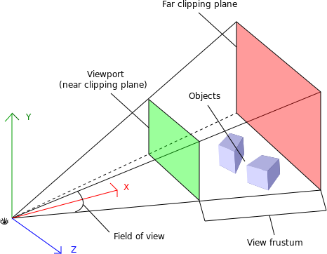

## [The Lost Art of 3D Rendering Without Shaders

A python implementation for this [article](http://machinethink.net/blog/3d-rendering-without-shaders/).

Original Swift implementation can be found on [Github](https://github.com/hollance/Swift-3D-Demo)

## References

- Pitch, Roll, Yaw

- [Viewport - Chinese](http://breezymove.blogspot.tw/2012/02/viewport.html)

[source](https://www.safaribooksonline.com/library/view/webgl-up-and/9781449326487/ch01.html)
